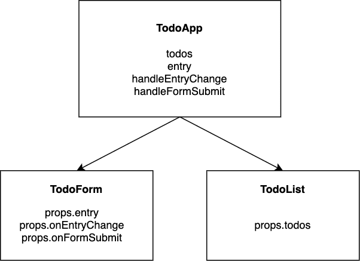

# Cải tiến component form

Xem xét component sau

```js
import { useState } from "react";

function App() {
    const [name, setName] = useState("");

    function handleNameChange(event) {
        setName(event.target.value);
    }

    return (
        <div>
            <h2>Hello {name}</h2>
            <form>
                <label htmlFor="name">Name: </label>
                <input
                    type="text"
                    id="name"
                    value={name}
                    onChange={handleNameChange}
                />
            </form>
        </div>
    );
}
```

Component trên sẽ được tái cấu trúc thành

1. Tạo state name và hàm handleNameChange trong component App
2. Truyền value={name} và hàm onNameChange={handleNameChange} vào component NameForm như 1 prop

```js
import { useState } from "react";
import NameForm from "./NameForm.js";

function App() {
    const [name, setName] = useState("");

    function handleNameChange(event) {
        setName(event.target.value);
    }

    return (
        <div>
            <h2>Hello {name}</h2>
            <NameForm name={name} onNameChange={handleNameChange} />
        </div>
    );
}
```

Trong component NameForm sử dụng name và onChangeName được truyền vào từ props

```js
export default function NameForm(props) {
    return (
        <form>
            <label htmlFor="name">Name: </label>
            <input
                type="text"
                id="name"
                value={props.name}
                onChange={props.onNameChange}
            />
        </form>
    );
}
```

> NameForm là stateless component vì nó không quản lý state nào

# Chia sẻ trạng thái giữa các component

```js
// TodoApp.js
import { useState } from "react";
import TodoForm from "./TodoForm.js";
import TodoList from "./TodoList.js";

function TodoApp() {
    const [todos, setTodos] = useState([]);
    const [entry, setEntry] = useState("");

    function handleEntryChange(event) {
        setEntry(event.target.value);
    }

    function handleFormSubmit(event) {
        event.preventDefault();
        setTodos([...todos, entry]);
        setEntry("");
    }

    return (
        <>
            <TodoForm
                entry={entry}
                onEntryChange={handleEntryChange}
                onFormSubmit={handleFormSubmit}
            />
            <TodoList todos={todos} />
        </>
    );
}

// TodoForm.js
function TodoForm(props) {
    return (
        <form onSubmit={props.onFormSubmit}>
            <label htmlFor="todo">Enter To do: </label>
            <input
                type="text"
                id="todo"
                value={props.entry}
                onChange={props.onEntryChange}
            />
        </form>
    );
}

// TodoList.js
function TodoList(props) {
    return (
        <ul>
            {props.todos.map((todo, index) => (
                <li key={index}>{todo}</li>
            ))}
        </ul>
    );
}
```


